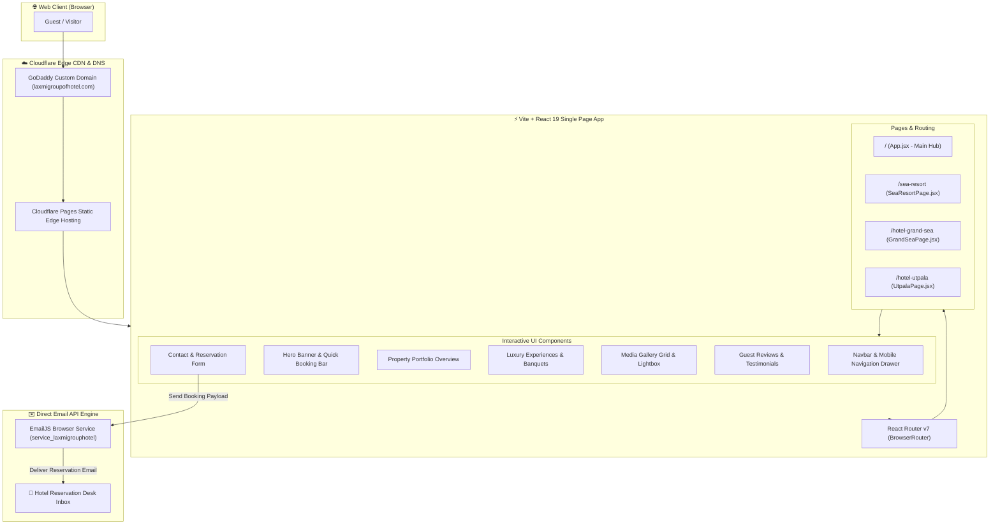
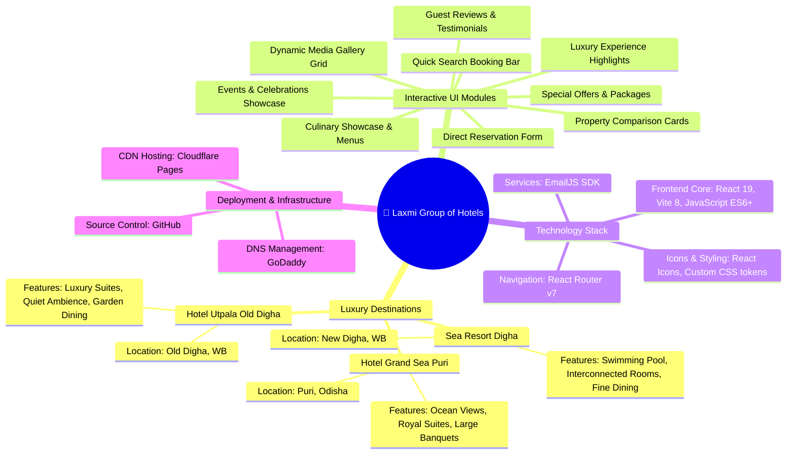
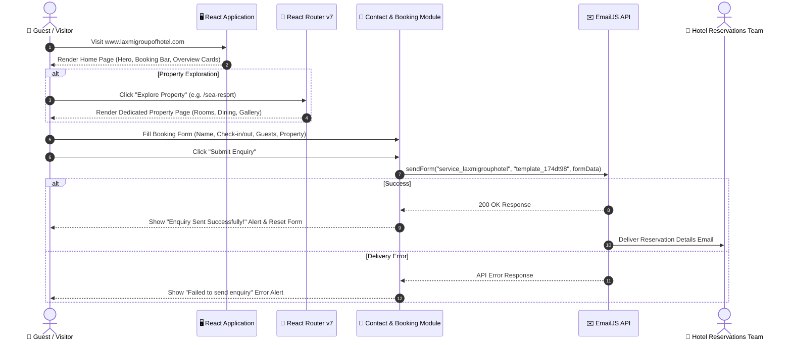
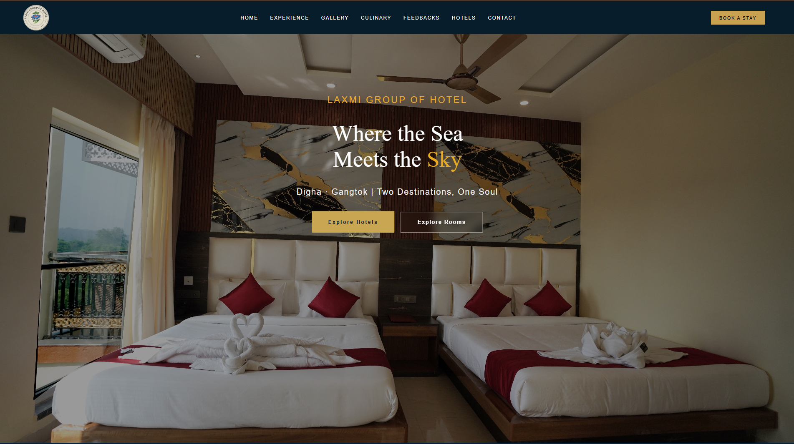
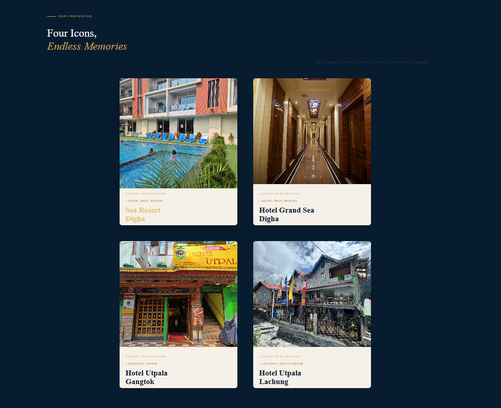
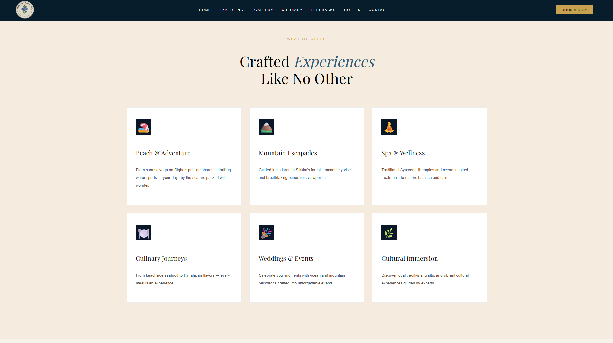
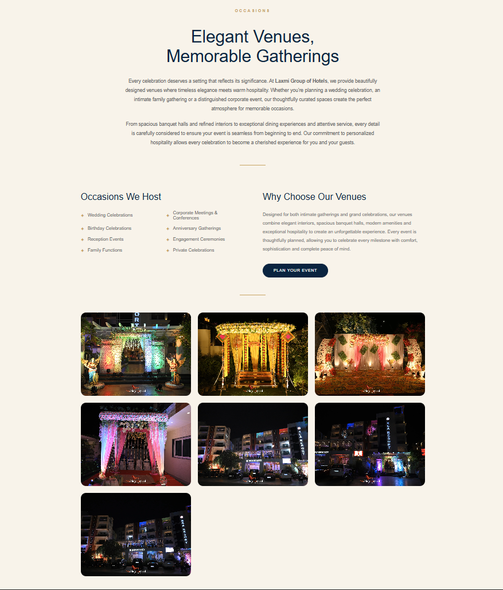
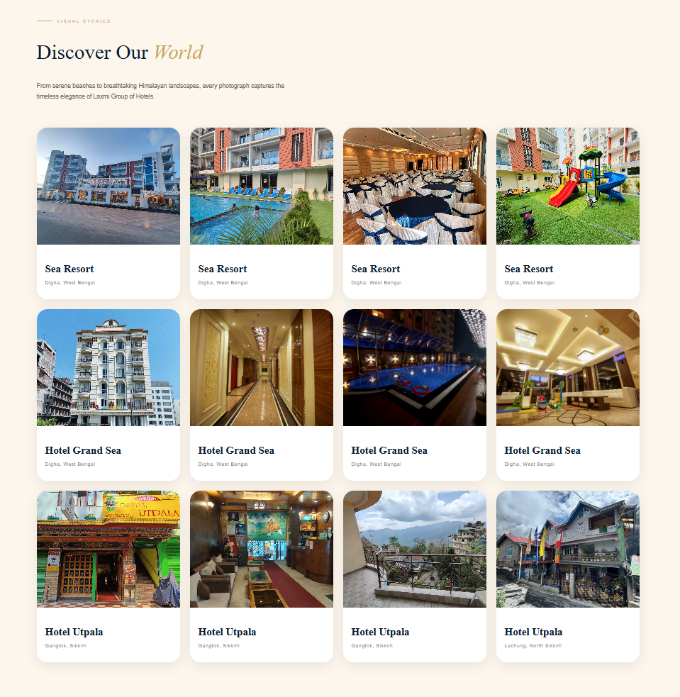
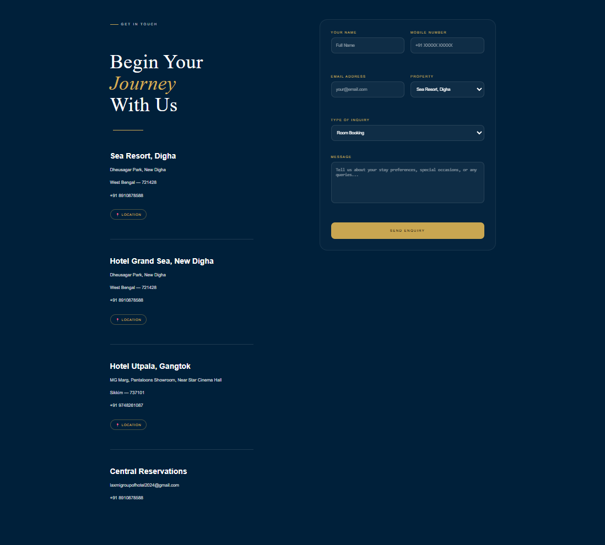

<div align="center">

# 🏨 Laxmi Group of Hotels

### Luxury Hospitality & Multi-Property Web Platform built with React 19 & Vite 8

A premier, high-performance website created to showcase the timeless elegance, luxury accommodations, fine dining, and unforgettable experiences across **Laxmi Group of Hotels** destinations.

[🌐 Explore Live Website](https://www.laxmigroupofhotel.com) • [📖 Property Matrix](#-property-portfolio-matrix) • [🏗️ System Architecture](#-system-architecture) • [🧠 Mind Map](#-website-ecosystem-mind-map)

<br>

[](https://react.dev/)
[](https://vitejs.dev/)
[](https://reactrouter.com/)
[](https://www.emailjs.com/)
[](https://pages.cloudflare.com/)
[](https://www.laxmigroupofhotel.com)

</div>

---

## 📖 About The Project

**Laxmi Group of Hotels** website is designed to provide guests with an immersive digital journey before they even arrive. From seaside luxury resorts in **Digha** to coastal retreats in **Puri**, the platform presents each property's rooms, suites, amenities, event spaces, culinary delights, and special packages through a modern single-page and multi-page hybrid architecture.

### 🌟 Key Highlights
- **Lightning-Fast Performance**: Built on React 19 and Vite 8, utilizing WebP compressed assets and zero heavy UI frameworks for fast load times.
- **Direct Reservation Engine**: Integrated with `@emailjs/browser` to route guest inquiries directly to hotel management without needing an external backend database.
- **Multi-Property Pages**: Dedicated landing routes for each luxury destination (`/sea-resort`, `/hotel-grand-sea`, `/hotel-utpala`).
- **Fully Responsive**: Crafted with modern CSS tokens, flexbox/grid, and micro-interactions optimized across Desktop, Tablet, and Mobile viewports.
- **Automated Deployment**: Cloudflare Pages CI/CD pipeline triggers automatic production deployments on every `git push` to the `main` branch.

---

## 🏨 Property Portfolio Matrix

| Property | Destination | Highlights & Accommodations | Route / Explore |
| :--- | :--- | :--- | :--- |
| **Sea Resort Puri** | New Digha, West Bengal | Outdoor Pool, Deluxe/Suite/Family Interconnected Rooms, Fine Dining & Banquets | [`/sea-resort`](https://www.laxmigroupofhotel.com/sea-resort) |
| **Hotel Grand Sea** | Puri, Odisha | Beachside Luxury, Executive Suites, Royal Family Rooms, Ocean View Banquets | [`/hotel-grand-sea`](https://www.laxmigroupofhotel.com/hotel-grand-sea) |
| **Hotel Utpala** | Old Digha, West Bengal | Luxury Couple & Family Suites, Peaceful Atmosphere, Event Spaces | [`/hotel-utpala`](https://www.laxmigroupofhotel.com/hotel-utpala) |

---

## 🏗️ System Architecture

The web application follows a decoupled Jamstack architecture. Static production assets are globally distributed via Cloudflare's Edge Network CDN. Client-side routing is handled by React Router v7, while reservation inquiries are directly processed via EmailJS API.



---

## 🧠 Website Ecosystem Mind Map

The following mind map outlines the functional structure, user features, technology stack, and deployment pipeline of the Laxmi Group of Hotels web platform:



---

## 🔄 Guest Journey & Reservation Flow

The flowchart below demonstrates the interactive sequence when a guest visits the site, explores property details, and submits a reservation inquiry:



---

## ✨ Comprehensive Feature Set

- 🏨 **Multi-Property Showcase**: Dedicated detailed pages with room descriptions, amenities, gallery highlights, and dining options for each property.
- 📅 **Interactive Booking Search Bar**: Instant property, check-in, check-out, guest count selection bar.
- ✉️ **Serverless Direct Emailing**: Live integration with `@emailjs/browser` to receive reservation inquiries directly to hotel admin emails.
- 🖼️ **Optimized Media Assets**: WebP image compression used across all luxury photos for minimal bandwidth consumption.
- 📱 **Mobile-First Responsive Design**: Drawer navigation on mobile, smooth touch scroll, and dynamic layout scaling.
- ⬆️ **Automatic Scroll-To-Top**: Seamless route transitions with `ScrollToTop` component restoring top page view on navigation.
- 🌟 **Reviews & Feedback Carousel**: Highlights real customer experiences and testimonials.
- 🎉 **Events & Banquet Venues**: Showcases event packages for weddings, corporate meetings, and family celebrations.

---

## 🚀 Tech Stack & Dependencies

### Frontend Framework & Libraries
- **[React 19](https://react.dev/)**: Latest component-driven user interface library (`react`, `react-dom` `v19.2.4`).
- **[Vite 8](https://vitejs.dev/)**: Next-generation frontend build tool providing lightning-fast HMR and bundle optimization (`v8.0.1`).
- **[React Router DOM v7](https://reactrouter.com/)**: Dynamic client-side routing (`v7.15.1`).
- **[React Icons](https://react-icons.github.io/react-icons/)**: Modern, lightweight SVG icon package (`v5.7.0`).
- **[@emailjs/browser](https://www.emailjs.com/)**: Serverless email transmission SDK for client-side form submissions (`v4.4.1`).

### Build & Code Quality
- **[ESLint 9](https://eslint.org/)**: Code analysis and linting (`v9.39.4`).
- **CSS3 / Vanilla CSS**: Custom CSS design system with variables for typography, glassmorphism, animations, and color palettes.

### Hosting & Infrastructure
- **Cloudflare Pages**: Global CDN hosting with continuous deployment pipeline.
- **GoDaddy**: Domain Registrar and DNS manager (`www.laxmigroupofhotel.com`).

---

## 📂 Project Structure

```text
laxmi-group-hotel/
│
├── public/                     # Static assets & web icons
├── screenshots/                # README preview screenshots
│   ├── home.png
│   ├── properties.png
│   ├── experiences.png
│   ├── events.png
│   ├── gallery.png
│   └── contact.png
│
├── src/                        # Main application source code
│   ├── assets/                 # WebP compressed images & brand icons
│   ├── components/             # Reusable UI component modules
│   │   ├── About.jsx           # Luxury brand backstory & values
│   │   ├── BookingBar.jsx      # Quick availability & booking search bar
│   │   ├── Contact.jsx         # Contact details & EmailJS booking form
│   │   ├── Culinary.jsx        # Fine dining & culinary showcase
│   │   ├── Events.jsx          # Events & Banquet hall showcase
│   │   ├── Experiences.jsx     # Premium guest experience highlights
│   │   ├── Feedback.jsx        # Customer testimonials & reviews
│   │   ├── Footer.jsx          # Links, social media & copyright footer
│   │   ├── Gallery.jsx         # Interactive image gallery grid
│   │   ├── Hero.jsx            # Video/Image landing banner with CTA
│   │   ├── Navbar.jsx          # Responsive header & drawer navigation
│   │   ├── Offers.jsx          # Special promotions & luxury packages
│   │   ├── Properties.jsx      # Multi-property overview cards
│   │   └── ScrollToTop.jsx     # Route change scroll reset handler
│   │
│   ├── pages/                  # Dedicated single-property view pages
│   │   ├── GrandSeaPage.jsx    # Hotel Grand Sea Puri detail page
│   │   ├── SeaResortPage.jsx   # Sea Resort Digha detail page
│   │   └── UtpalaPage.jsx      # Hotel Utpala Old Digha detail page
│   │
│   ├── App.css                 # Page-level custom styles
│   ├── App.jsx                 # Core single-page assembly
│   ├── index.css               # Main design system tokens & baseline CSS
│   └── main.jsx                # React DOM entry point & Router configuration
│
├── .gitignore                  # Git excluded files
├── eslint.config.js            # ESLint code quality configuration
├── index.html                  # HTML5 document template
├── package.json                # Project dependencies & scripts
├── vite.config.js              # Vite build configuration
└── README.md                   # Project documentation hub
```

---

## 📸 Website Preview

### 🏠 Home Page Landing


---

### 🏨 Our Luxury Properties


---

### ✨ Guest Experiences


---

### 🎉 Events & Celebrations


---

### 🖼 Photo Gallery


---

### 📞 Contact & Reservation Form


---

## ⚙️ Local Development Setup

Follow these steps to run the Laxmi Group of Hotels project on your local environment:

### Prerequisites
- **Node.js** (v18.0.0 or higher recommended)
- **npm** (v9.0.0 or higher)

### 1. Clone the repository
```bash
git clone https://github.com/adarshhhgupta/laxmi-group-hotel.git
```

### 2. Navigate into the project directory
```bash
cd laxmi-group-hotel
```

### 3. Install dependencies
```bash
npm install
```

### 4. Run the development server
```bash
npm run dev
```

### 5. Open in Browser
Navigate to `http://localhost:5173` to view the website locally.

---

## 🏗️ Production Build & Verification

To create an optimized production bundle:

```bash
# Build production bundle
npm run build

# Preview production build locally
npm run preview
```

The output bundle will be generated inside the `dist/` directory, ready for deployment.

---

## 🚀 Deployment Pipeline

The website relies on continuous integration and deployment (CI/CD) provided by **Cloudflare Pages**:

```text
Developer Push ──► GitHub (main branch) ──► Cloudflare Pages Build ──► Edge CDN ──► Live Site
```

1. Code changes are pushed to the `main` branch of the GitHub repository.
2. Cloudflare Pages automatically detects the push and triggers `npm run build`.
3. The generated `/dist` folder is published instantly across Cloudflare's global edge network.
4. Custom domain `www.laxmigroupofhotel.com` points to Cloudflare Pages DNS.

---

## ⚡ Performance & Optimization Strategies

- **WebP Image Assets**: All photos are pre-compressed into WebP format, reducing asset sizes significantly.
- **Vite Chunking**: Efficient code splitting ensuring minimal bundle load for initial render.
- **Pure CSS Tokens**: Zero heavy CSS frameworks like Bootstrap/Tailwind; pure custom CSS variables ensure lightweight rendering.
- **Serverless Form Handling**: Direct EmailJS client API call eliminates backend latency for form handling.

---

## 🎯 Future Enhancements

- 💳 **Online Booking Engine & Payment Gateway**: Integration with Razorpay/Stripe for real-time room payments.
- 🔐 **Admin Dashboard**: Portal for hotel managers to update room rates, availability, and special packages.
- 📍 **Interactive Maps**: Embedded Google Maps API with route directions for guests.
- 🌐 **Multilingual Support**: Internationalization (i18n) for Hindi, Bengali, and English travelers.
- 📝 **Hotel Blog**: Travel guides, local sightseeing tips, and guest stories.

---

## 👨‍💻 Developer & Credits

**Adarsh Kumar Gupta**  
*Artificial Intelligence & Machine Learning*  
MVJ College of Engineering

- **GitHub**: [@adarshhhgupta](https://github.com/adarshhhgupta)
- **Live Website**: [www.laxmigroupofhotel.com](https://www.laxmigroupofhotel.com)

---

## ⭐ Support & Feedback

If you find this project impressive or useful, please consider giving it a **⭐ Star** on GitHub!

---

## 📄 License & Copyright

Developed for **Laxmi Group of Hotels**. All rights reserved.

© Laxmi Group of Hotels. Unauthorized copying or redistribution is strictly prohibited.